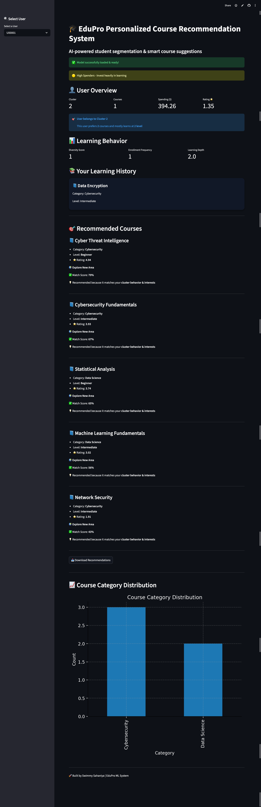

# 🎓 EduPro Personalized Course Recommendation System

<p align="center">
  
</p>

<p align="center">
  🚀 AI-powered student segmentation & personalized course recommendations
</p>

---

## 🌐 Live Demo
👉 https://swimmysahaniya-edupro-recommendation-system-uiapp-aqupyc.streamlit.app/

---

## 📌 Project Overview

EduPro is an **end-to-end Machine Learning project** that analyzes student behavior and segments users using clustering techniques to deliver **personalized course recommendations**.

It simulates a real-world EdTech platform where learners receive **smart, data-driven suggestions** instead of generic recommendations.

---

## 💡 Why This Project Matters

Most learning platforms provide **generic recommendations**.

EduPro solves this by:
- Understanding **user behavior patterns**
- Segmenting users into meaningful groups
- Delivering **personalized recommendations**

👉 This improves:
- User engagement
- Course completion rates
- Learning experience

---

## 🎯 Key Features

✅ User Segmentation using **KMeans Clustering**  
✅ Advanced Feature Engineering  
- Diversity Score  
- Learning Depth  
- Enrollment Frequency  

✅ Personalized Recommendation Engine  
✅ Interactive Dashboard using **Streamlit**  
✅ Real-time User Insights & Visualization  

---

## 🧠 Machine Learning Workflow

1. **Data Preprocessing**
   - Handling missing values
   - Encoding categorical features
   - Feature scaling

2. **Feature Engineering**
   - Behavioral metrics creation
   - Aggregation at user level

3. **Clustering (KMeans)**
   - Elbow Method for optimal K
   - Silhouette Score for validation

4. **Recommendation Logic**
   - Cluster-based filtering
   - Popularity & rating-based ranking

---

## 🎯 Recommendation Strategy

The recommendation system follows a **hybrid approach**:

### 1. Cluster-Based Filtering
Users are grouped using KMeans, and recommendations are generated based on:
- Similar users in the same cluster
- Popular courses within that cluster

### 2. Smart Filtering
- Already enrolled courses are removed
- Only new relevant courses are suggested

### 3. Ranking Logic
Courses are ranked based on:
- Course Rating ⭐
- Popularity within cluster

### 4. Personalization Layer
- Match with user's preferred category
- Balance between:
  - 🎯 Familiar courses (Best Match)
  - 🌍 Exploratory courses (Discovery)

### 5. Confidence Score
Each recommendation includes a **Match Score (%)** based on:
- Course rating
- User interest alignment

---

## 🏗️ System Architecture

User Data → Feature Engineering → Clustering → Recommendation Engine → Streamlit UI

1. Raw Data (Users, Courses, Transactions)
2. Feature Engineering
3. KMeans Clustering
4. Top Courses per Cluster
5. Real-time Recommendation in UI

---

## 📈 Key Insights

- Users with high spending tend to prefer advanced courses
- Beginner users explore multiple categories
- Cluster-based recommendations improve relevance significantly

---

## 🔮 Future Improvements

- 🔐 User Authentication System
- 🤖 Deep Learning-based Recommendations
- 📊 Real-time user behavior tracking
- 🌐 Deploy as SaaS product
- 📱 Mobile-friendly UI

---

## 📊 Tech Stack

| Category        | Tools Used |
|----------------|-----------|
| Programming     | Python |
| Data Processing | Pandas, NumPy |
| Machine Learning| Scikit-learn |
| Visualization   | Matplotlib |
| UI Framework    | Streamlit |

---

## 📸 Demo

<p align="center">
  
</p>

---

## 🎥 Project Feedback Video

[Watch Project Explanation](https://your-video-link-here)

---

## 🖥️ Run Locally

```bash
# Clone repository
git clone https://github.com/swimmysahaniya/edupro-recommendation-system.git

# Move into project
cd edupro-recommendation-system

# Install dependencies
pip install -r requirements.txt

# Run app
streamlit run ui/app.py